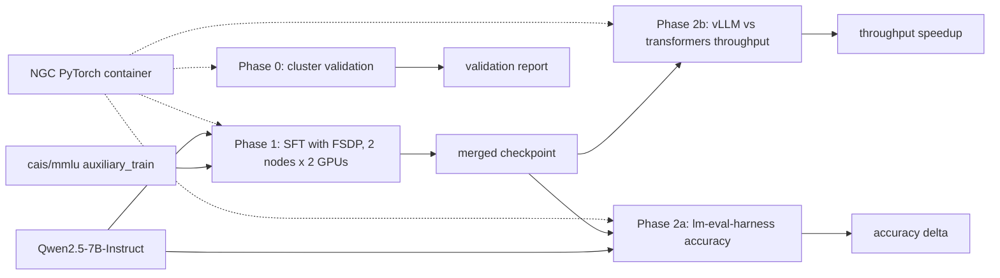

# hpc-llm-bench

Reference workflow for end-to-end LLM fine-tuning and inference benchmarking on a multi-node Slurm + Pyxis GPU cluster. Built as a Nebius take-home exercise (AI/ML Specialist Customer Solution Architect role); designed to be a reusable starting point for similar PoCs.

## Architecture

The diagram is interactive on GitHub: click any node to jump to its source or results.



Dotted lines: every Slurm job runs inside the NGC PyTorch container via Pyxis (no image build step). Solid lines: data and artifact flow.

## Assignment summary

A VC-funded startup wants to reserve **512 × H100s for 6 months** on Nebius. Before committing they want a PoC proving performance/reliability. We get a Slurm cluster (**2 nodes, 8 × H200 each = 16 H200s total**; jobs use up to **4 GPUs**) shared with other users.

**Deliverables**

1. **Cluster validation** — a lightweight, portable container that validates the cluster is ready for training/inference. Build code + results in this repo.
2. **Phase 1 — Training** — end-to-end **multi-node** fine-tune of an open-source LLM against at least one category from `cais/mmlu`. Justify model, framework, hyperparams, distributed-training technique.
3. **Phase 2 — Evaluation** — (a) show accuracy improvement of fine-tuned vs base, then (b) optimize **either latency or throughput** for inference and prove the result with experiments. Provide reproduction docs.

> Note: the brief says "choose one of the following options to complete" but Phase 2 references the Phase 1 model — treating them as a sequence, not a choice. Will confirm with Marija if ambiguous.

## Layout

```
validation/   # cluster-readiness container + checks (NCCL, GPU, fabric, storage I/O)
training/     # Phase 1 — fine-tuning code & configs
evaluation/   # Phase 2 — accuracy + latency/throughput experiments
sbatch/       # Slurm submission scripts (one per stage)
docs/         # runbook, design decisions, reproduction guide
results/      # logs, metrics, plots (gitignored where bulky)
```

## Environment

- Cluster: 2 nodes × 8 × H200, Slurm scheduler, shared with other users.
- Job size: up to 4 GPUs per job — be considerate of memory/storage/CPU.
- Access key: `~/.ssh/nebius_assignment` (local).
